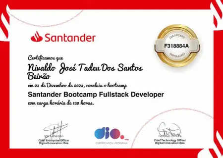

Daily learning

# AI Career Mentor Discover Your Future in Tech

Project developed at the Bootcamp CAIXA - Artificial Intelligence in Practice with guidance from specialist [Henrique Eduardo Souza](https://www.linkedin.com/in/hsouzaeduardo/?locale=pt_BR "Henrique Eduardo Souza").

Learning to perform an integration between two agents: 
- Conduct a structured 7-question interview with Agent 1,
- After collecting the information, suggest 3 ranked careers and transfer them to Agent 2,
- Receive the information from Agent 1 and generate a complete study plan.

[LICENSE](/LICENSE)

See [original repository](https://github.com/digitalinnovationone/copilot-prompts).

---

<!--START_SECTION:header-->

  

    
    <h1>Santander Fullstack Developer Bootcamp</h1>
  

<!--END_SECTION:header-->

  
  

<!--  -->
<table align="center">
<thead>
  <tr>
    <td>
        
Expert

        <a href="https://github.com/felipeAguiarCode">
         
      </a>
    </td>
    <td colspan="3">
    
10+ years in commercial systems with .NET C# and NODE.JS.
       
     Fullstack developer - Education coordinator at DIO
       
    Focus on SPA front-ends with React, Angular and Vue.js
    

      
        
    </td>
  </tr>
</thead>
</table>
<!--  -->

 
 

## About the Project

What a Front-End Developer does:

- Create responsive and accessible web interfaces  
- Implement reusable components in modern frameworks  
- Integrate APIs in the front-end to consume data  
- Ensure performance and page optimization  
- Collaborate with designers and back-end developers  

## Prerequisites of Skills and Knowledge Levels

Before starting this content, it is necessary to have prior knowledge in the following areas:

Skills Map

ESSENTIAL SKILLS:

- HTML5, CSS3 (Flexbox, Grid, responsiveness)
- JavaScript (ES6+, DOM, events, async/await)  
- Modern frameworks (React.js)  

COMPLEMENTARY SKILLS:

- TypeScript
- Testing (Jest, React Testing Library)  

Tools and Technologies:

- React.js
- Git/GitHub  
- Figma (design and prototyping)  
- REST/GraphQL APIs  
- Vite/Webpack (build and optimization)  

## Skills and Sub-skills We Will Learn in This Content

### 1 - Fundamentals

- Review of semantic HTML and best practices
- Advanced CSS: Flexbox, Grid, responsiveness
- Basic JavaScript (variables, functions, loops, DOM)  
- Git/GitHub: versioning and collaboration  

### 2 - Advanced JavaScript  

- ES6+, modules, arrow functions, promises  
- API consumption with fetch/axios  
- Async/await, error handling  
- Simple project: consume a public API (e.g., movie list)  

### 3 - React Fundamentals

- JSX, components, props and state
- Basic hooks (useState, useEffect)  
- Routing with React Router  
- Project: simple SPA (e.g., product catalog)  

### 4 - Advanced React

- Context API, advanced hooks (useReducer, useContext)
- Integration with REST APIs  
- TypeScript in React  
- Project: interactive dashboard with charts and filters  

### 5 - Performance and Testing  

- Performance optimization (lazy loading, memoization)  
- Unit testing with Jest and React Testing Library
- Best practices in accessibility and UX  
- Project: accessible application with responsive design  

### 6 - Portfolio and Preparation

- Final integrative project: complete React app with authentication and API consumption
- Deployment on Vercel/Netlify
- Preparation for technical interviews  
- Review of basic algorithms and conceptual questions  

## Objectives and Expected Results

After completing the course/bootcamp, students will be able to:

- face challenges, solve problems in modern front-end projects (React, JavaScript, APIs), gaining experience and consolidating their career as Front-End Developers.

# Certificate

<!--START_SECTION:footer-->

 
 

  

